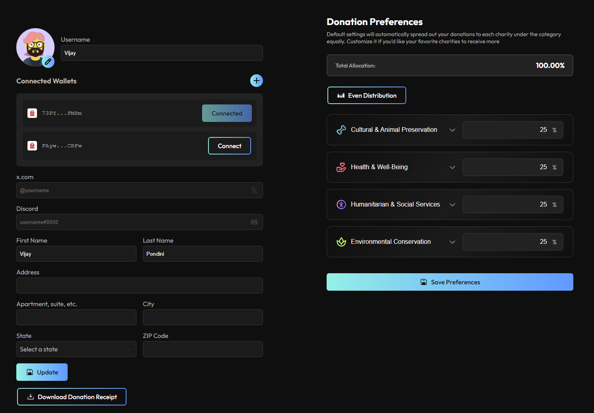

# Donation Preferences

You can update your donation preferences ONLY if you have registered your wallet on our website, https://charitysoul.io/ . By default, donations are equally split amongst all charities. This means that a holder of charitySOL will never _need_ to visit the website in order to start giving.

You can access your donation preferences on your profile page - https://charitysoul.io/profile

<figure><figcaption></figcaption></figure>

Here, you can also edit your personal information for donation reciepts. As you can see, you can split your charity donation % by category. You can additionally customize your donation % for each charity per category as well

<figure><figcaption></figcaption></figure>

Once these preferences are saved, it will reflect in the next cycle when your yield is donated!
